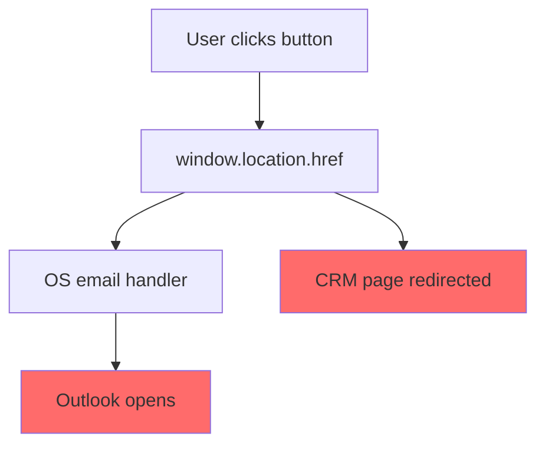
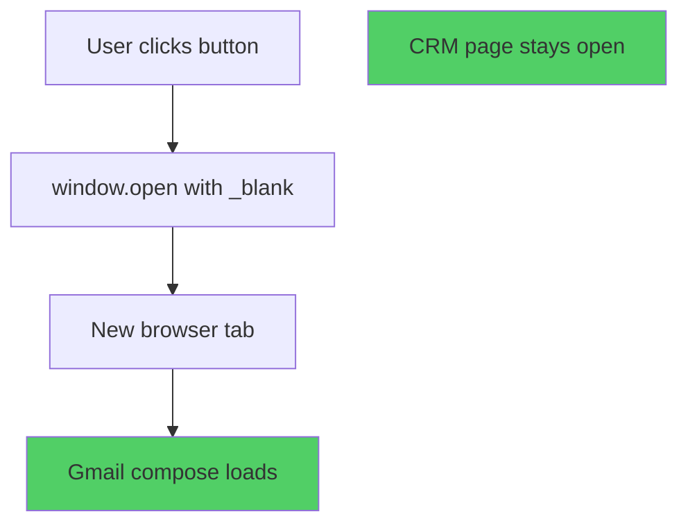

# Gmail Integration - Before & After Comparison

## 🔴 BEFORE: Using `mailto:` Protocol

### Code
```typescript
// Handle opening in email client
const handleOpenInEmailClient = () => {
    if (!toEmail) {
        alert('Please enter a client email address');
        return;
    }

    // Create mailto link
    const mailtoLink = `mailto:${toEmail}?subject=${encodeURIComponent(subject)}&body=${encodeURIComponent(message)}`;
    
    // Open in default email client
    window.location.href = mailtoLink;
    
    // Close modal after a short delay
    setTimeout(() => {
        onClose();
    }, 500);
};
```

### Problems
❌ Opens **default email client** (Outlook, Thunderbird, etc.)  
❌ No control over which application opens  
❌ Redirects **current tab** (loses CRM page)  
❌ Cannot guarantee browser-based email  
❌ Not specifically Gmail

### User Experience Flow
1. User clicks "Open in Email Client"
2. Browser triggers OS default email handler
3. **Outlook** (or other desktop app) opens
4. CRM page redirects to mailto: URL
5. User loses current page context

---

## 🟢 AFTER: Using Gmail Compose URL

### Code
```typescript
// Handle opening in Gmail compose
const handleOpenInEmailClient = () => {
    if (!toEmail) {
        alert('Please enter a client email address');
        return;
    }

    // Create Gmail compose URL with pre-filled fields
    const gmailComposeUrl = `https://mail.google.com/mail/?view=cm&fs=1&to=${encodeURIComponent(toEmail)}&su=${encodeURIComponent(subject)}&body=${encodeURIComponent(message)}`;
    
    // Open Gmail in a new tab
    window.open(gmailComposeUrl, '_blank');
    
    // Close modal after opening Gmail
    setTimeout(() => {
        onClose();
    }, 300);
};
```

### Benefits
✅ Opens **Gmail web interface** in Chrome  
✅ Full control over destination  
✅ Opens in **new tab** (keeps CRM page open)  
✅ Guaranteed browser-based email  
✅ Specifically Gmail compose

### User Experience Flow
1. User clicks "Open in Email Client"
2. Gmail compose opens in **new Chrome tab**
3. **All fields pre-filled** (to, subject, body)
4. CRM page **stays open** in original tab
5. User can switch between tabs easily

---

## 📊 Side-by-Side Comparison

| Aspect | `mailto:` | Gmail URL |
|--------|-----------|-----------|
| **Destination** | Default client (Outlook/etc.) | Gmail web interface |
| **Browser** | Not guaranteed | Chrome/any browser |
| **Tab Behavior** | Redirects current tab | Opens new tab |
| **CRM Page** | Lost on redirect | Stays open |
| **Pre-fill Fields** | ✅ to, subject, body | ✅ to, subject, body |
| **User Control** | OS-dependent | Browser-controlled |
| **Offline Support** | ✅ Desktop apps work | ❌ Requires internet |
| **Login Required** | ❌ No | ✅ Gmail login needed |

---

## 🎯 Real-World Example

### Input Data
```javascript
toEmail = "chavandhiksha2003@gmail.com"
subject = "Crystal Group - Cold Chain Solutions for Test | Dry"
body = `Dear Sir,

Greetings from Crystal Group (Cold Chain Containers) !!

I hope this email finds you well, Thanks for your valued enquiry...`
```

### Before: `mailto:` Link
```
mailto:chavandhiksha2003@gmail.com?subject=Crystal%20Group%20-%20Cold%20Chain%20Solutions%20for%20Test%20%7C%20Dry&body=Dear%20Sir%2C%0A%0AGreetings%20from%20Crystal%20Group...
```
**Result:** Opens Outlook desktop app (undesired)

### After: Gmail URL
```
https://mail.google.com/mail/?view=cm&fs=1&to=chavandhiksha2003%40gmail.com&su=Crystal%20Group%20-%20Cold%20Chain%20Solutions%20for%20Test%20%7C%20Dry&body=Dear%20Sir%2C%0A%0AGreetings%20from%20Crystal%20Group...
```
**Result:** Opens Gmail compose in Chrome (desired) ✅

---

## 🔍 URL Parameter Differences

### `mailto:` URL Structure
```
mailto:EMAIL?subject=SUBJECT&body=BODY
```
- Protocol-based (not HTTP)
- Handed off to OS
- No view control

### Gmail URL Structure
```
https://mail.google.com/mail/?view=cm&fs=1&to=EMAIL&su=SUBJECT&body=BODY
```
- HTTPS protocol
- Direct Gmail endpoint
- Explicit view parameter (`view=cm`)

---

## 🧪 Testing: Before vs After

### Test Scenario
**Action:** Click "Open in Email Client" button from leads page

### Before Behavior
1. `window.location.href` executed
2. Browser launches OS email handler
3. **Outlook opens** (wrong)
4. CRM page navigates away
5. User must navigate back manually

### After Behavior
1. `window.open()` executed with `_blank` target
2. Browser opens new tab
3. **Gmail compose loads** (correct)
4. CRM page remains in original tab
5. All fields pre-filled in Gmail

---

## 💡 Key Code Changes

### Change 1: URL Construction
```diff
- const mailtoLink = `mailto:${toEmail}?subject=${encodeURIComponent(subject)}&body=${encodeURIComponent(message)}`;
+ const gmailComposeUrl = `https://mail.google.com/mail/?view=cm&fs=1&to=${encodeURIComponent(toEmail)}&su=${encodeURIComponent(subject)}&body=${encodeURIComponent(message)}`;
```

### Change 2: Opening Method
```diff
- window.location.href = mailtoLink;  // Redirects current tab
+ window.open(gmailComposeUrl, '_blank');  // Opens new tab
```

### Change 3: Timing
```diff
- setTimeout(() => { onClose(); }, 500);  // Longer delay
+ setTimeout(() => { onClose(); }, 300);  // Faster UX
```

### Change 4: UI Text
```diff
- This will open in your default email client
+ This will open Gmail compose in a new tab
```

---

## ✅ Acceptance Criteria Met

| Requirement | Before | After |
|-------------|--------|-------|
| Opens Gmail in Chrome | ❌ Opens Outlook | ✅ Opens Gmail |
| Pre-fill to/subject/body | ✅ Yes | ✅ Yes |
| Opens in new tab | ❌ Redirects page | ✅ New tab |
| CRM page stays open | ❌ Lost | ✅ Stays open |
| No mailto: fallback | ❌ Uses mailto: | ✅ Only Gmail |

---

## 🎬 Visual Flow Comparison

### Before: `mailto:` Flow


### After: Gmail URL Flow


---

## 📈 Impact Summary

### User Experience Improvements
- ✅ **Predictable behavior** - Always opens Gmail
- ✅ **Context preservation** - CRM page stays accessible
- ✅ **Faster workflow** - No app switching needed
- ✅ **Browser-based** - Consistent cross-browser experience

### Technical Improvements
- ✅ **Explicit destination** - Direct Gmail endpoint
- ✅ **Better UX pattern** - New tab vs redirect
- ✅ **Faster execution** - 300ms vs 500ms timeout
- ✅ **Clearer intent** - Updated UI messaging

### Business Value
- ✅ **Reduced friction** - Users already in browser
- ✅ **Higher adoption** - Familiar Gmail interface
- ✅ **Better tracking** - Browser history shows interaction
- ✅ **Professional** - Consistent with modern web apps
